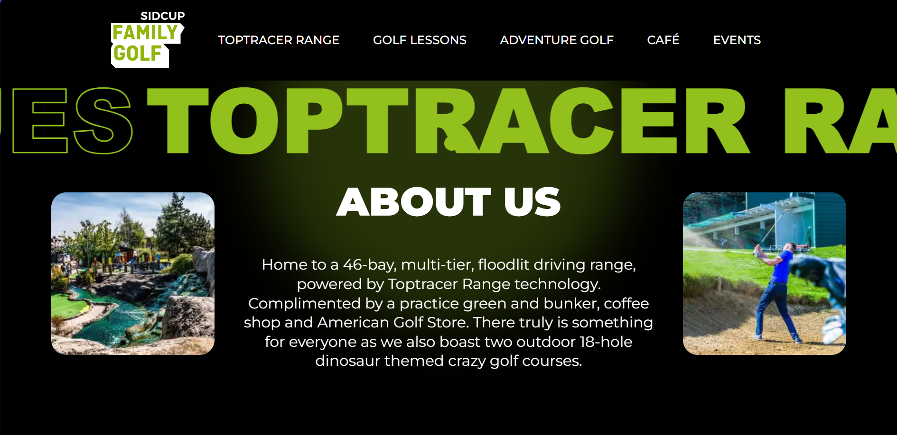

# Sidcub Golf Family Clone

This project is a user interface (UI) clone of the Sidcub Golf Family website. It has been created using HTML, CSS, and JavaScript, with animations powered by GSAP.

## Features

- Accurate representation of the Sidcub Golf Family website UI.
- Smooth animations and transitions using GSAP.

## How to Run

1. Clone this repository to your local machine.
2. Open the `index.html` file in your web browser.

## Technologies Used

- HTML
- CSS
- JavaScript
- GSAP (GreenSock Animation Platform)

## Credits

- Sidcub Golf Family for the original design inspiration.
- GSAP for providing powerful animation capabilities.

## Screenshots

---

🙏 Thanks for visiting! 😊